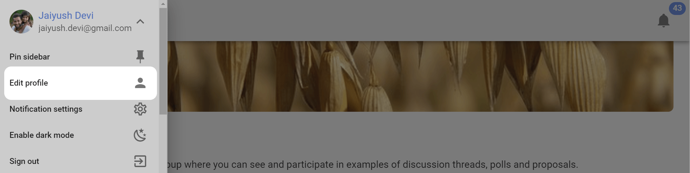

# Your Profile
Your Loomio user profile is how people recognize you.  

Being able to recognize people in Loomio helps build trust and authenticity, encouraging more genuine participation.  So wherever possible we encourage you to be you, and to add a photo or avatar.

## Edit profile

Your profile page lets you customize your Loomio identity. To visit your profile page select the **Edit profile** option in the user menu, which is found by clicking on your name at the top of the sidebar. 

If the sidebar is closed, click on the menu icon (**☰**) to open it.

Click on the down arrow to the right of your name.

Click on **Edit profile**

## Update your personal info

You can update your personal info by changing any of the following fields:

* **Name**
* **Email address** - this is the email address associated with your Loomio account, and where you will receive notifications from Loomio.
* **Username** - your username is a name people can recognize and alert you using @mention.
* **Introduction** - a few lines to tell others in your group something about you.
* **Location** - useful for distributed or remote groups so people can get an idea of where you are located.

## Uploading a profile photo
When you first create a Loomio account, your initials will be the default image associated with your profile. You can upload a profile photo by clicking on your picture on the profile page. 

If you have a [Gravatar](https://en.gravatar.com/) you can set that as your profile picture by selecting **Use Gravatar**. You can also choose for Loomio to use the photo you use for other common platforms/tools.

## Language settings
Loomio is developed in English, but [is translated by volunteers into many languages](https://www.loomio.com/g/cpaM3Hsv/loomio-community-translation).

Loomio will detect your browser’s language settings, but you can manually set your preferred language from the available options on the profile page.

## Resetting your password
You can change your password by visiting your profile page and clicking **Reset Password**.

## Deleting your account

Go to the section on [Deleting Your Loomio Account](../deleting_your_account)
