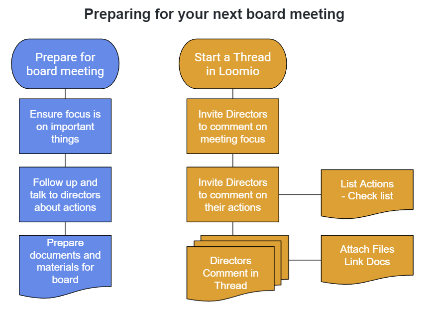

# Introducing a new online tool to your organisation

*This guide is to help you consider how to introduce Loomio to your organisation and make best use of the tools available.*

Introducing people to a new technology doesn't just happen - it requires some intentional work on the part of everyone to build new patterns of work and behaviour, while respecting the different challenges everyone has in fulfilling their role.

There are real benefits of using a digital tool such as Loomio to enhance your collaborative work together.

**Let's explore some key questions below**

* [Why do we need an online place for discussion and decisions?](#why-do-we-need-an-online-place-for-discussion-and-decisions)
* [How secure is the information?](#how-secure-is-the-information)
* [How will you structure Loomio to suit your organisation?](#how-will-you-structure-loomio-to-suit-your-organisation)
* [How do our current work processes adapt to our online practices?](#how-do-our-current-work-processes-adapt-to-our-online-practices)
* [How quickly do you expect each other to respond?](#how-quickly-do-you-expect-each-other-to-respond)
* [What protocols do you want to establish in relation to notifying individual people?](#what-protocols-do-you-want-to-establish-in-relation-to-notifying-individual-people)
* [When is it best to continue a thread and when to start a new one?](#when-is-it-best-to-continue-a-thread-and-when-to-start-a-new-one)
* [How do you know what kind of poll to use?](#how-do-you-know-what-kind-of-poll-to-use)
* [When should you use a proposal instead of a poll?](#when-should-you-use-a-proposal-instead-of-a-poll)
* [Does the CATSI Act allow us to use Loomio as our statutory obligation?](#does-the-catsi-act-allow-us-to-use-loomio-as-our-statutory-obligation)

---

## Why do we need an online place for discussion and decisions?

Good governance exists where an organisation has systems and processes in place that are appropriate to its circumstances, and which enable the organisation to pursue its purpose effectively and meet its obligations under the law.

*“It is participatory, consensus-oriented, accountable, transparent, responsive, effective and efficient, equitable and inclusive and follows the rule of law.”*

Underpinning all of these principles is the need for good communication.

Many directors and boards of Indigenous Corporations experience challenges:

* Getting directors together in person
* Difficulty for directors to join online video meetings
* Unfamiliarity with online technology
* In remote locations with poor internet connectivity
* Governance practices still forming
* Dealing with a high volume of transactional business (e.g. approving land and financial transactions)

Loomio offers an opportunity to strengthen governance, to extend collaboration beyond board meetings, to include everyone in open, honest and respectful discussion while documenting everything.

---

## How secure is the information?

Your group is private, and you are in control of who you invite to the group, and therefore who has access to information in the group.

**Who can access the information?** 
Only people who are invited to the group. Click on the **Members** tab to see members of your group.

**Can ORIC access the information?** 
No. Named Loomio staff members (Michael and Rahul) may be present in your group to help you with set up. They will leave the group when established or you can remove them from the group at any time.

**Can I invite an adviser or accountant into a particular discussion?**
Yes. You can invite an external person to contribute to a particular Loomio thread discussion.

---

## How will you structure Loomio to suit your organisation?
A Loomio group comprises a 'parent group' and any number of 'subgroups'. 

Subgroups help you organize the work of particular groups of people; for example a subcommittee, working group or project team. You may also set up a subgroup for communicating with membership.

Subgroups work just like groups. Most of the features and settings of subgroups are the same as in your parent group, and include the ability to allow members of the parent group to see, but not participate in, threads and polls in the subgroup. This is helpful if you want to offer transparency of discussions and decisions to members of the parent group.

A person can be a member of your subgroup and not of your parent group.

Typical subgroups for Indigenous Corporations include:

* Financial subcommittee
* Health & Safety
* Risks & Audits
* An industry-specific subgroup, such as "Property"
* Membership

You may also want to set up a subgroup to share information and engage with Corporation membership. 

Always review subgroup privacy and permissions are set appropriate for the  work of the subgroup. 

---

## How do our current work processes adapt to our online practices?

As a discussion and decision-making tool, Loomio is flexible and can be configured to suit your current work processes.

For example, typical work processes of a board include:

### Preparing for the next board meeting
**Board work process:**
* follow up and talk to directors about actions
* ensure the focus of the meeting is about the most important things
* documents and materials
* actions from previous meeting
* notify directors and send board papers
* agree a date/time for the next meeting

***On Loomio:***
*Use a Loomio **Thread** to prepare for your board meeting:*
* *invite directors to comment on meeting focus*
* *list actions and invite directors to comment on their actions*
* *directors comment in thread and attach files and link to docs and other resources*

### Notify Directors of next board meeting
**Board work process:**
* *notify directors about the next meeting*
* *attach or link documents and other necessary materials*
* *summarise actions and invite directors to update on their tasks*

*Use a Loomio **Time Poll** to find the next meeting date.*

---

### Administrative governance practices
**Board work process:**
* approve meeting minutes, along with matters arising
* pass Chief Executive, Finance and Health & Safety reports
* prepare resolutions
* investor/stakeholder reports

***On Loomio:***
*Use Loomio **Polls**:*
* *to approve minutes and note matters arising before the meeting.*
* *to pass CE and Finance reports*
* *to prepare resolutions in advance of meeting and record votes and outcome*
* *to approve reports to be published*

---
### Out of session decision
**Board work process:**
* make decisions there was not time for in meeting
* make decisions that do not require much discussion (e.g. approving annual insurance renewals)
* build consent for strategic direction. (This may be triggered by external event or a director's particular interest)

***On Loomio:***
*Use a Loomio **Thread** to start an out-of-session discussion and a Loomio **Proposal** to make a decision.*

*(A Loomio Proposal is a particular type of Poll that asks people to agree to a course of action and records the decision made. It is also useful to clarify disagreement and help you resolve an issue.)*

---

### Statutory requirements:
**Board work process:**
* Annual General Meeting (AGM)
* Tax and annual financial statements
* ORIC reporting

***On Loomio:***
* *Use Loomio **Threads** to prepare the information necessary to meet statutory requirements, and attach appropriate documents. Invite directors to question and respond to the information.* 
* *Use Loomio **Proposal** to approve documents for filing.*

---
## How quickly do you expect each other to respond?
Loomio is like email in that you can respond at a time that suits you. However everyone has different work habits, and taking too long to respond is likely to be frustrating for others.

In the early days of using Loomio, it really helps if everyone responds as soon as they can with a comment, vote or reaction.

On the other hand, when posting a thread or comment don't expect everyone to respond immediately. Give people time to read and digest the information - particularly on complex or important topics.

If people are not responding, you can prompt them through Loomio by sending a reminder or with a comment using @mention.

Use Polls and Proposals so people can see that something is happening, and that now is the time to have their say.

If some people are still not responding, raise a discussion at your next board meeting and seek agreement on the importance of good communication and commitment to timely response. 

---
## What protocols do you want to establish in relation to notifying individual people?

There are many places within Loomio that you can notify people including:
* Invite to a Thread
* Invite to a Poll or Proposal
* @mention a specific person within a comment

When you notify a person, you are sending them an email. So to avoid overloading their inbox, it's usually best to only notify people when something important is happening, or if you need to get their attention.

If you are setting up a Thread to notify directors about the next meeting, it may include several Polls and Proposals.  Rather than sending notifications to every event, it is usually sufficient to notify people once about the Thread, and ask them to read the information and vote in any Polls or Proposals.  

It is a advisable to have a quick discussion with your group to establish a protocol that works for them, so they receive the notifications they need and are not overwhelmed with too many.

---
## When is it best to continue a thread and when to start a new one?

Loomio Threads usually focus on a particular topic.  As the discussion progresses on the topic, the thread continues until it reaches an outcome.  

If a new topic is introduced during your discussion in the thread, you may wish to start a new thread.  In the new thread, you can add links to the old thread and even to specific comments, making reference to the previous discussion.

There are tools within Loomio that enable you to copy, edit and move comments to another thread.

Here are some common types of threads in governance:
* Holding all the information about a particular meeting
* Reports (e.g. Chief Executive or Financial subcommittee reports)
* Preparing and agreeing a Resolution
* Explore an important question
* Prepare for an event, such as a members meeting
* Collaborate on a policy document

---
## How do you know what kind of poll to use?

There are several Loomio Polls and they have a wide application. You will likely find the following Polls valuable for Board use.

### Check Poll 

A Check is a tool with many possible uses but only 2 responses: a tick (✔) or an x mark (✘). Participants will use the tick (✔) to say yes and the x mark (✘) to say no or unsure.

Help directors get ready for your next meeting with Loomio Check Poll. 

Checking in with directors to ensure they're prepared and have all the information they need will save a lot of blank looks and confusion during a meeting, and save you precious meeting time.

*Add Check Poll image*

### Poll

The simple Poll can be useful for approving minutes of a directors meeting.

If the minutes are in a file (e.g. a Word document), attach the file to the Poll. In the Poll description, ask directors to vote to **Accept** or **Review** if they see anything they would like to discuss.

Set **Accept** and **Review** as the Poll options.

### Time Poll

Use Loomio Time Poll to find the best time to meet and ask directors to respond. It will enable them to also see other's availability and juggle their calendars if they can. 

---
## When should you use a proposal instead of a poll?

Proposals are a great way to make a decision with your board. For example; approving a financial report, passing a resolution or making an out of session decision.

Here are a few examples of how Proposals are used to make decisions in a board:

* Resolution to approve a funding application
* Resolution to approve new terms of lease
* Approve annual financial statements
* Form a subcommittee
* Approve statement to shareholders
* Approve strategic plan
* Inviting a guest to a board meeting
* Approving CEO hire
* Accept insurance quotation

---
## Does the CATSI Act allow us to use Loomio as our statutory obligation?

Yes. Loomio enables documented discussion and decisions in one place.

Whereas some Corporations try to make decisions via email, which can be scattered and difficult to track.

**Can we run an out of session resolution?**

Yes. If you circulate a decision outside of a formal meeting it requires 100% directors to agree to it for the resolution to pass.

Exception: If you delegate a subcommittee to make a decision and report back to the board.

---
