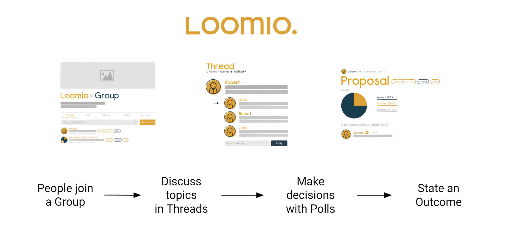

# Overview

Loomio is a decision making tool for collaborative organizations.

It enables you to bring people together, have discussions on topics, explore proposals and make decisions.

It's a discussion forum with a set of tools to allow you to facilitate a discussion towards an outcome.

<iframe width="608" height="380" src="https://www.youtube.com/embed/Zlzuqsunpxc" title="YouTube video player" frameborder="0" allow="accelerometer; autoplay; clipboard-write; encrypted-media; gyroscope; picture-in-picture" allowfullscreen></iframe>

Loomio is often used by:

**Boards and Governance** to prepare for meetings, build an agenda, post board papers, vote on resolutions, approve minutes and continue governance between meetings. Helping your board stay in context and better able to respond.

**Member organizations** as a safe, inclusive space for members to share information and raise topics, interact and debate, participate in important decisions and   General Assembly. Including members' voice to organize for action.

**Self-managing teams** to work together, share info and ideas, progress discussions, follow decision making processes and achieve better outcomes. Increasing staff satisfaction and productivity.

Loomio builds a living record of your organization; the decisions made, who was involved and the discussion they had together leading to the decision. 

## How Loomio works

Loomio is a simple structure of three main elements; Group, Thread and Decisions. 

### Group

A Loomio group is a safe place for your organization to meet, discuss and make decisions about work.

**Group home**

Your group home page is the first place you see when you arrive. It contains a title, an image to represent the group, and some text to introduce the group: its purpose, the work you will do, and any other information to help group members participate.

### Thread

Threads are where you share information, discuss, and make decisions.

Threads are used for many purposes; to prepare for a meeting, discuss matters, share reports, ask questions, vote on proposals, approve actions, and so on. It's also where your group can develop a shared understanding of important issues.

Threads keep everything about a topic in one place. Over time you’ll create a useful archive of your organization’s discussions and decisions.

### Polls

One of the best things about Loomio is its range of tools to progress a discussion to an outcome. Each poll type has a slightly different purpose. The most common one is a proposal. 

A **proposal** is for converting a discussion into a clear, practical outcome. Someone suggests a course of action and invites everyone to respond. For example, you might ask group members to either:
- agree
- abstain or 
- disagree. 

Importantly, as well as selecting a response, everyone can give a reason why they have voted this way. You can all see where everyone else stands on the matter, and why. And then, if you want, you can change your response. 

A proposal, and associated discussion, creates its own record of how the decision came about.

## Putting it all together

The best way to learn what to use when is to have a go. Use your own group or [start a demo group](https://loomio.org/try).
