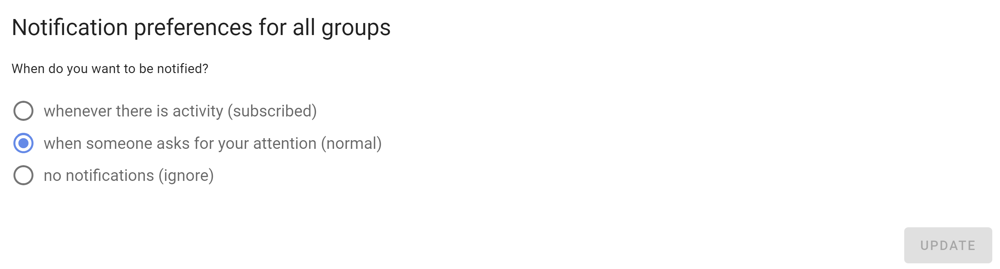

# A quick tour of Loomio

There are several tools included within Loomio to help you find the information you are looking for quickly, and to help you to participate in discussion threads and decision votes.

## Sidebar

The sidebar menu is accessible from the (☰) menu icon at screen top left, where you can see:

* **Dashboard** - open Polls and Proposals and recently active Threads.
* **Unread threads** - a list of Threads you have yet to read.
* **Invite-only threads** - private Threads that do not belong to a group.
* **Start a new thread** - where you can start a new private Thread. 

The sidebar menu is also where you can easily navigate to your Loomio groups and subgroups.

### User settings

Click the down arrow ( ∨ ) to open your user settings.

The most useful settings when getting started are:

* **Edit profile** - Where you can edit name, email address, upload your photo, introduce yourself, add your location.
* **Notification settings** - Set what emails you want to receive from Loomio.
* **Help** - Access Loomio Help documentation.
* **Contact support** - Where you can connect with the Loomio customer support team.

## Notifications

### In app notifications

The bell icon in the top-right is where notifications are accessed within Loomio.

### Email notifications

Loomio sends emails to keep you updated on the activity in your groups. 

Emails Loomio may send you include:

* **Mention and Replies** - When someone @mentions you in a comment or replies to you, you will receive a notification email.
* **Subscribe on participation** - If selected, when you participate in a thread you will receive emails for all further activity. Not recommended for most people.
* **Catch-up summary email** - The 'Yesterday on Loomio' email includes activity from all your groups and threads that you have not read yet.
* **Invitations to threads, polls and proposals** - You may receive an email when invited to a new thread, poll or proposal.
* **Reminders and Outcomes** - If you have not voted in a poll or proposal, you may receive a reminder 24 hours before close. You may also receive an email stating the outcome of a poll or proposal.

These emails are to help you participate effectively with your group. The default settings are to help you stay up to date with activity on Loomio but should not overload your email inbox.

If you are receiving too many emails from Loomio, you can change the default email settings. Talk to your group administrator to get the balance right for you.

When you receive an email from Loomio, you can reply directly from your email inbox and your reply will be posted into the Loomio thread. This works for everything except the Catch-up summary email.

## Group page

### group page tabs

## Thread page

### context
### activity
### comment

### timeline

## Poll page
