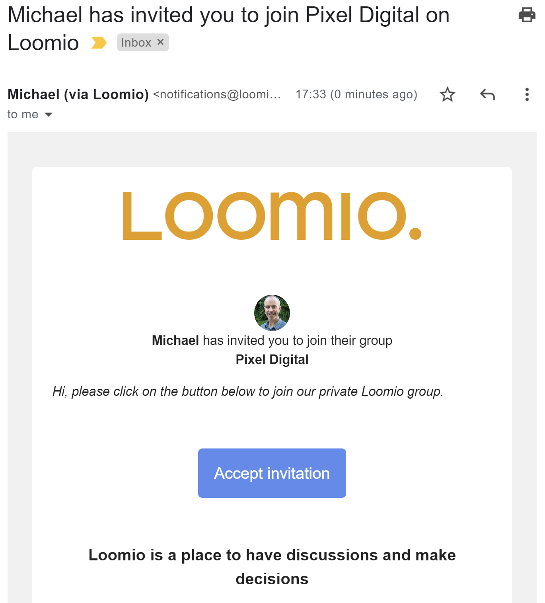
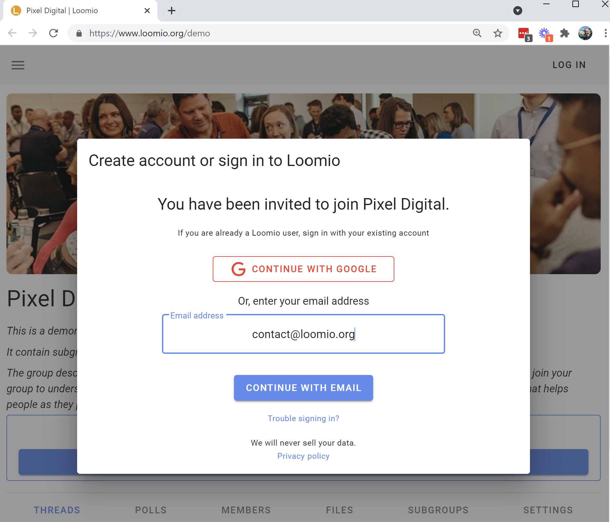
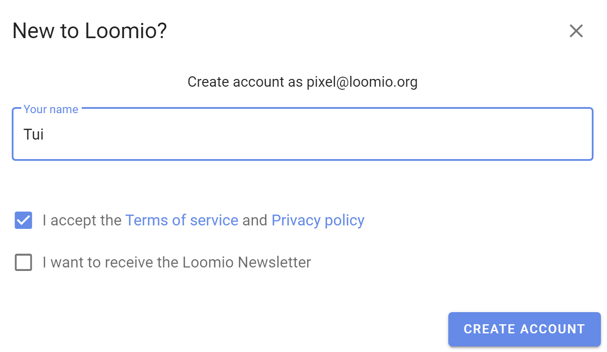
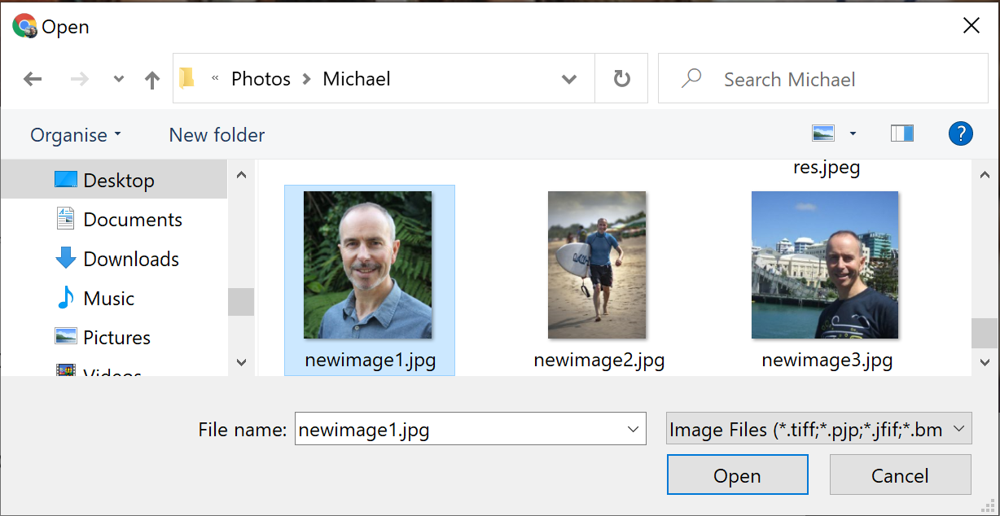

# You've been invited!

Signing up to Loomio is easy - you don’t need a password, and your computer will remember you in future.

**Invitation via email**

Your invitation to join your Loomio group will arrive in your email inbox and look something like this:

Click the **Accept invitation** button at the centre of the email.

The link will take you to the internet browser on your computer, tablet or smartphone and open a page where you are invited to create an account on the service at decisions.oric.gov.au.

On your computer you will see:

Click the **CONTINUE WITH EMAIL** button at the centre of the screen.

You will be taken to this page to create your Loomio user account.

Type in your name, so people in your group will recognise you.

Click the **CREATE ACCOUNT** button at the bottom right hand corner of the screen.

A Loomio user account will then be created for you.

## Upload profile photo (Optional)

We encourage you to upload a profile picture which will be displayed whenever you make a comment. This is helpful for other members to easily identify you. This step is optional.

If you don’t want to add a photo now: Click 'Use initials'

Click **Upload new photo**.

Select a suitable photo file from your computer.

Click **Open** to upload your photo.

## Returning to Loomio

### Sign in via email
When you sign in via email, you'll be sent an email with a link (or a code) to sign in.

### Forgot your password?

1. Go to the sign-in, put in your email address.
2. Click **Sign in with email**
3. Click **Send sign in email**
3. Retrieve the code that Loomio sends to your email (Subject, "Sign in to Loomio") and paste that into the form that appeared.  ***Now you're logged in. Change your password by…***
4. Go to [edit profile](https://www.loomio.org/profile "open in new tab") and change your password; you can [follow these instructions](https://help.loomio.org/en/guides/getting_started/notifications_settings/#resetting-your-password).

### Tips for a better experience

#### Set a password
If you don't want to check your email to sign in, you can easily set a password. To do this, take the same steps you would to [change your password](../user_profile/#resetting-your-password).

#### Don't create more than one user account
Remember to use the same email address each time you login, or you may end up with two user accounts, which will cause permission errors when you're checking notifications.

Sometimes people think they need two Loomio accounts because they have two groups and they want to keep things separated; However, Loomio is designed to support belonging to multiple groups with one user account.

### Merging user accounts
If you do find yourself with more than one user account, you can [merge them](../merge_accounts).

### You can accept an invitation sent to another email address
Invitations are not tied to the email they are sent to. If someone sends you an invitation to an email address other than the one you use for your Loomio user account, you do not need to create a new user account or get the invitation re-sent.

Just click the invitation link and replace the text in the email form with the email address you would like to use, or the email address of your existing account, as you proceed.

### You can sign in with email even if you first signed in via Google
After creating an account via a third party (eg: Google), you can still sign in with email. Just enter the email address associated with your Google account into the Email address field and **Sign in with email**.

### Linking a third party to an existing user account
If you want to sign in with a third party (eg: Google) but you already have a Loomio account with another email address, you can link your accounts. To do this, just sign in via your preferred third party, Loomio will recognize it's your first time using that sign-in method. Enter the email address of your existing account and **Link accounts** when you have the choice between this (don't click **Create account**).
