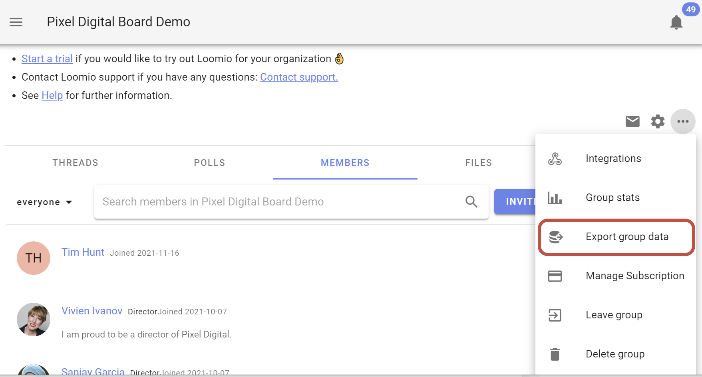

# Group data backup or export

With the group data export feature you can:

- Open poll results in a spreadsheet or scripting language
- Print or save PDF's of a thread or poll for archival purposes
- Move you group, including all users, threads, polls, and files to another Loomio server.

If you ever want to move from Loomio managed servers [to your own](https://github.com/loomio/loomio-deploy), you can use this feature.

If you're running your own Loomio server, and would rather not anymore, Loomio offer managed hosting in USA, EU and Australia. If you'd like to migrate your group to one of these servers, please [contact us](https://www.loomio.org/contact).

## Export

Open the group drop down menu by clicking on the three dots, and select **Export group data**.

### Export group data as CSV

*For working with the group data in a spreadsheet, such as with MS Excel or Google Sheets.*

You'll be prompted to choose a destination on your computer for the CSV file.

### Export group data as HTML

*For when you want to save the data for archival purposes.*

This will open the HTML file in another tab in your browser. If you want to save the file, right-click anywhere on the page and click "Save as".

### Export group data as JSON

*For when you want to move your group data to a self-hosted Loomio instance.*

You'll shortly receive an email with a link to downloading the JSON file.

## Import your group data on another Loomio server

For instructions on setting up your own Loomio server, visit: https://github.com/loomio/loomio-deploy

If you are hosting your own Loomio deployment, and would like to import your exported data:

Copy the .json file to the container instance's `import` folder:

`scp your-group-data.json username@some-domain.org:loomio-deploy/import`

Access the running Rails console:

`docker exec -ti loomio-app rails console`

Call the service:

`GroupExportService.import('/import/your-group-data.json')`
