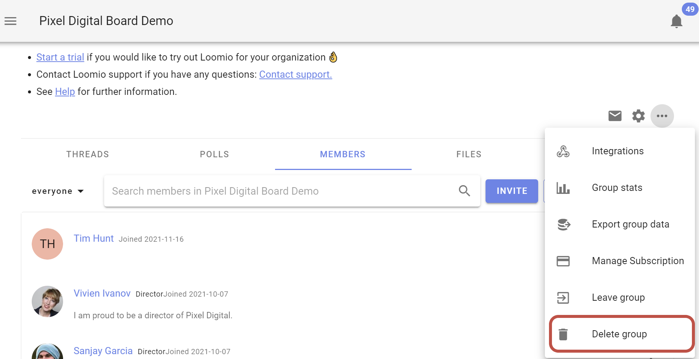
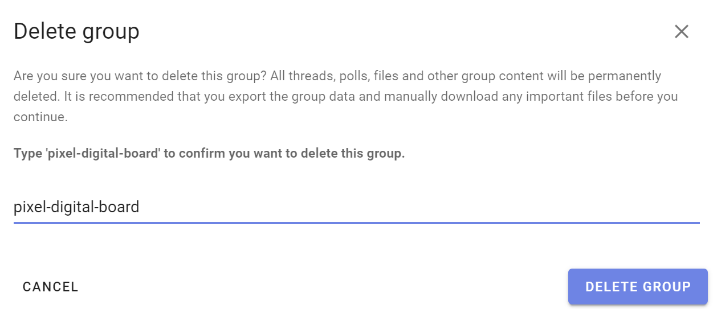

# Deleting your group

Deleting your Loomio group initiates a process to permanently delete all group data. 

If there is any data you wish to retain, make sure you [export group data](../data_export) and manually download any important files you have uploaded before you continue.

Open the group drop down menu by clicking on the three dots, and select the **Delete group** option to remove access to the group and to initiate deletion of all group data from our records. You must be an admin to delete a group.

When you delete a group, it will be archived from view immediately and scheduled for permanent deletion in 2 weeks. You and group members will immediately lose access to the group.  If a mistake was made, you can contact us within two weeks of deleting your group to request restoration.

Deleting your group will also cancel your Loomio subscription.

You will be invited to type the name of your group (*case sensitive*) to confirm you wish to delete your group.

### Group data is permanently deleted after 2 weeks

Two weeks after you use **Delete group**, all the threads, polls, files and other group content will be permanently deleted. ***This is non-reversible!*** 

We recommend that you [export](../data_export) the group data and manually download any important files you have uploaded before you continue.
