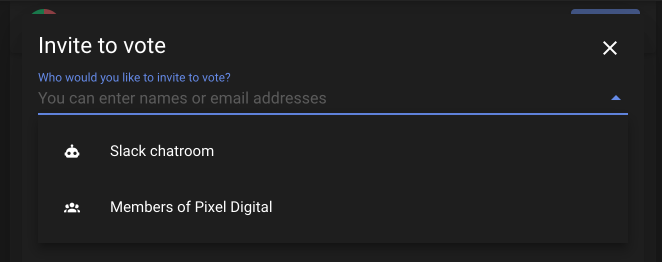

# Loomio Chatbots

Loomio can send notifications to your chatroom!

Chat tools and Loomio work well together. Chat is like an open or 1:1 conversation in your office, and Loomio is like getting people together in a meeting room to discuss a particular topic and make a decision. 

Loomio supports Slack, Discord, Microsoft Teams, Matrix and Mattermost.

You can send notifications to your chatroom any time you like, just the same way you would invite individual people to vote, or to join a thread.

You can also configure notifications to always happen when a specific event happens, like someone starting a thread.

## What it looks like in chat

## Generate a Webhook URL
We've prepared step by step walk-throughs for each service we support. Follow the right one for your service to obtain the webhook URL you'll need to add the chatbot in Loomio.

- [Slack](../slack/)
- [Microsoft Teams](../microsoft_teams/)
- [Discord](../discord)
- [Matrix](../matrix)
- [Mattermost](../mattermost)

Our webhook based system can also be used to support other systems that support incoming webhooks with either HTML or Markdown formatting. This could be something like Zapier or Rocketchat.
Just select the mattermost bot, but use a custom webhook URL.

## How to setup a chatbot

After configuring your chosen service (see above), you'll have a webhook URL.
Open the chatbot settings to pop it into a new chatbot for your group.

You probably don't want to click any of the checkboxes for now. Just enter the name (such as "Discord #general") and the URL and click the save button at the bottom of the form.

If you decide later on you want the chatbot to be notified every time something happens, you can come back and check some boxes.

### Invite to poll

This is how to send a notification to your chatroom inviting people to vote in a proposal.
It's the same process for Share outcome, Invite to thread, Remind to vote, Poll edited etc.

### Automatic notifications
If you want the chatbot to be notified every time a specific event happens, edit the settings and tick which events you want to notify the chatbot about.

