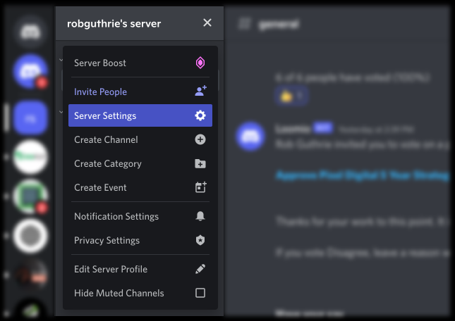
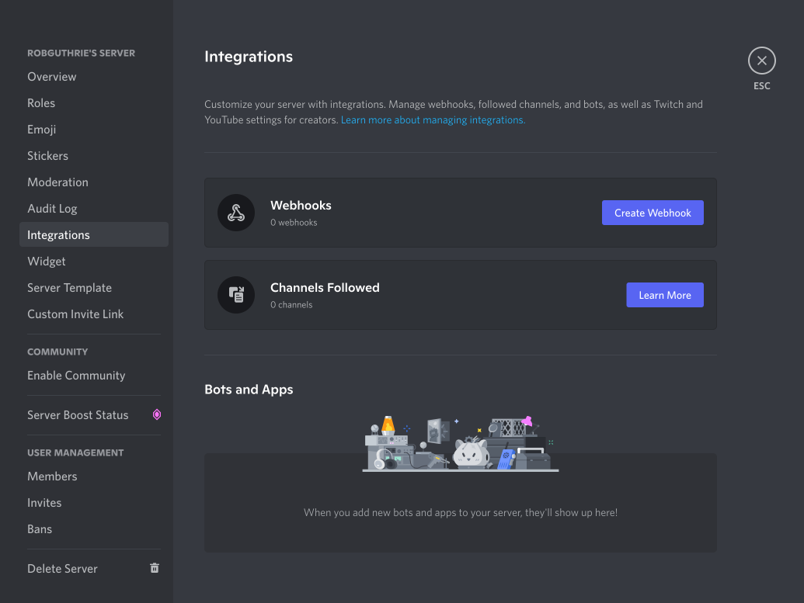
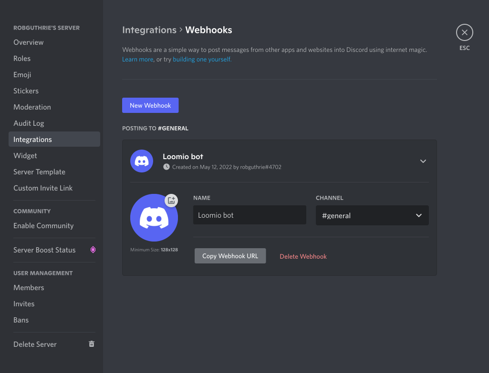

# Discord integration

_Connecting your Loomio group notifications to your Discord team chat._

Loomio can send notifications into your Discord channels when new discussions, proposals, comments, votes, and outcomes occur. You can also manually notify the chatroom when you need to remind people about a decision.

---

Open your Discord server and find the server settings menu.

Click "Integrations"

Then click "Add Webhook" and give it a name, like "Loomio bot"

Make sure you have copied the Webhook URL to your clipboard and follow the link below.

[Adding a chatbot in Loomio](../chatbots/#how-to-setup-a-chatbot)