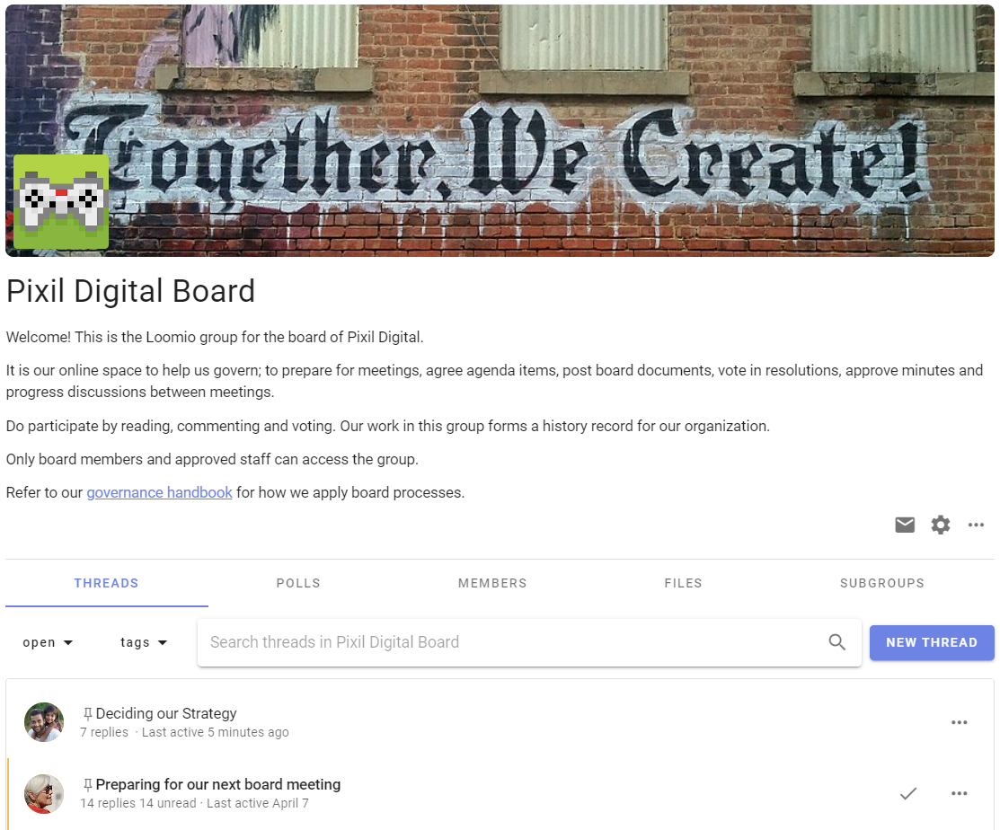

# Intro to Groups

A Loomio group is a safe place for people to meet, have discussions and make decisions. 

It’s a container where group members can find and share information, participate in important discussions and decisions that affect their work.  

A Loomio group looks like this.  At the top of the page you will see an image and logo that you can tailor to represent your organization.  This allows people arriving into your group to see they have joined a place they recognize and feel welcome - a safe space where people feel they can come and participate.

Choose a representative name for your group and use the group description to outline;
- **what** this group is used for
- **why** this is important
- **who** is participating 
- **how** members can participate

You may also include information like a code of conduct, terms of reference or other governing documents for the group.
