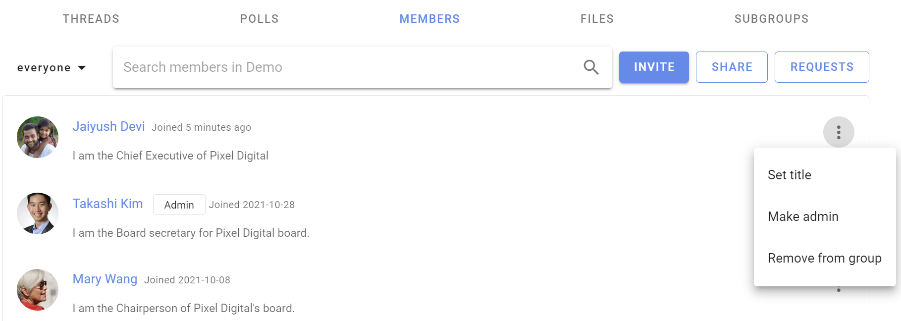

# Inviting people
_How to invite people and manage group membership._

Inviting people to join your Loomio group is a critical step to success - however everyone is busy; many people are reluctant to try a new tool and can be slow to respond to your invitation.  

Loomio includes tools to help you invite people; but you may also need to reach out to members by phone, text, chat or in a meeting, to tell them **why** you are using Loomio. If your group members resonate with this, it will encourage them to give it a go.

For example, your group might need:
- a safe space where members can find all the info they need and participate in their own time
- to stay in touch and respond to issues that come up between meetings 
- to progress discussions and make decisions as needed
- to have better meetings and focus precious meeting time on issues that matter

## Invite people

Go to your group page and click the **Members** tab to access member management

You can **Invite** particular people to your group with their email address or **Share** a link to your group via email, newsletter, chat or from your website.

<iframe width="100%" height="380px" src="https://www.youtube-nocookie.com/embed/RGv0Yq6sv8g?rel=0" frameborder="0" allowfullscreen></iframe>

## Invite people via their email

Click **Invite** on the Member tab of your group page to send an email invitation with a _single-use_ link to a person's email address.  The recipient is invited to create a Loomio user account and join your group.  

If the recipient already has a Loomio user account they can still accept the invitation to join your group with their existing account.

### Allow people to "Request to Join"

If your group's privacy is **closed** then you can share your group URL ie: `www.loomio.org/group-name`. When people arrive at your group page, they will see the group title and description, and a button **Join group** where they can request membership. Group admins will receive an email where you can approve or deny the request to join.

### Invite many at once

You can send invitations by email to up to 100 people at a time by entering (or copy/pasting) multiple email addresses into the "Who would you like to invite" box. Separate email addresses by comma or space. 

- **Tip**: Copy email addresses from a column in a Google or Excel spreadsheet, and paste into the invitation box.

When you submit the form (ie, click **Send**) an email will be sent to each of the email addresses you supplied, containing a unique invitation link that can only be used once. This email will be sent in your current language.

### Invite people to Subgroups

You will follow the same process as above.

You can invite people to a 'parent' group, and one or more subgroups simultaneously when you invite them with the **Invite people** button. Tick the boxes next to the subgroups you want them to immediately be a part of when they join the group. See it demonstrated in the video clip [just above](#inviting-people).

### Encourage people to particiapte

If people join but don't begin to participate right away, you might like to welcome them to the group with an @mention, for example:

> “Welcome to the group @Jane :) It's great to have you here! Would you saying a little bit about your work in this space?”

## Managing invitations

To manage invitations, open the filter/ drop down from the Members tab of your Group page and select **Invitations**; click on the three dot menu to the right of the member invitation.

<iframe width="100%" height="380px" src="https://www.youtube-nocookie.com/embed/BH0x494sZlU?rel=0" frameborder="0" allowfullscreen></iframe>

You can also make people administrators or set their title (eg, "IT Support") within the group before they accept their invitation.

### Re-send invitations

Follow up on people who don't make it into the group and give them a nudge. If someone has lost or forgotten about their invitation email, you can re-send it from the dropdown menu beside their name on the Members page.

Click on the three dots (**⋮**) next to the person you want to resend the invitation to, and then choose **Resend invitation**. 

### Cancelling invitations
If you entered the wrong email address, or have changed your mind about inviting someone, you can cancel an invitation from the Members tab on your Group page. Select **Cancel Invitation** from the drop down menu to the right of the member invitation (**⋮**).

## Managing memberships
Manage members from the Members tab on your Group page. 

Click on the three dots (**⋮**) to the right of the group member you wish to **Set title**, **Make admin** or **Demote admin**, or **Remove from group**.

### Admin
There are only two user types in a Loomio group; **member** and **admin**. 

Admins perform administrative tasks for your group including; add and remove members, grant and remove admin permissions, change group privacy and member permission settings, upgrade and manage subscription plans.

The person creating a new Loomio group is made admin by default. We recommend to make at least one other person in your group admin, to insure someone can always administer your group. 

Admins are people you trust to administer your group. You can have as many admins in your group as you wish.

To make a member **admin**, go to the Members tab, find the member and click on the three dots (**⋮**) next to their name. Choose **Make admin**. An `Admin` tag will appear beside their name.

#### Managing subgroups
If you are the admin of a parent group, or organization, you have additional permissions with regards to any __closed__ subgroups.

You will be able to join any closed subgroup by clicking the "Join Group" button on the left of the Subgroup page in question (just under the tabs).

Once you have joined the subgroup, you will also be able to make yourself the admin of that subgroup, just as you would promote anyone to admin ([see above](#admin)).

***Note:*** *these permissions do not extend to* ***secret*** *subgroups.*

### Removing group members
When you click **Remove from group** you'll be asked to confirm the removal. Upon removal, this user will no longer have access to the group's pages, threads, polls, or proposals. They will receive no further emails or notifications of group activity. However, any comments and votes written by the user will remain untouched.

After you have removed someone from the group, you can add them back to the group later if you wish.

### Leaving a group
To leave a group go to the Group page's **Settings** tab and click **Leave group**.

### Assigning titles
You can name the role someone has within the group, or identify which organization they represent using the **title** feature. You or an admin can change yours by clicking **set title** from the dropdown near your name in the desired group's Members tab.

You can even have different titles in different subgroups.

## Membership requests

If your group's [advanced settings](../settings/#advanced-settings) allow people to join your group **by request**, an admin will need to approve each membership request. Group coordinators will receive an email each time there is a new membership request. The link in the notification email will take you to the **Requests** page, where you can approve or decline the request.

To find pending requests for memberships, navigate to the Members tab of your Group page and click the **Requests** button on the right.

