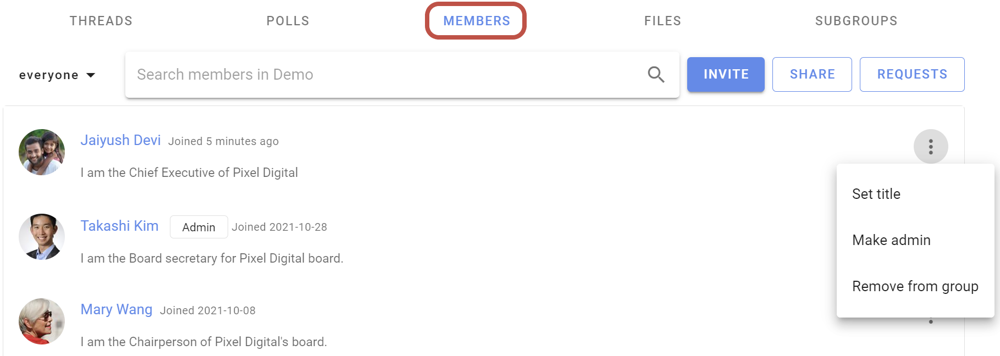
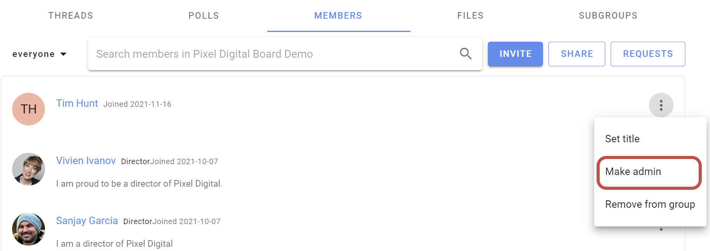

# Member management
Manage members from the Members tab on your Group page. 

Click on the three dots (**⋮**) to the right of the group member you wish to **Set title**, **Make admin** or **Demote admin**, or **Remove from group**.

## Admin
There are only two user types in a Loomio group; **member** and **admin**. 

Admins perform administrative tasks for your group including; add and remove members, grant and remove admin permissions, change group privacy and member permission settings, upgrade and manage subscription plans.

The person creating a new Loomio group is made admin by default. We recommend to make at least one other person in your group admin, to insure someone can always administer your group. 

Admins are people you trust to administer your group. You can have as many admins in your group as you wish.

To make a member **admin**, go to the Members tab, find the member and click on the three dots (**⋮**) next to their name. Choose **Make admin**. An `Admin` tag will appear beside their name.

### Managing subgroups
If you are the admin of a parent group, or organization, you have additional permissions with regards to any __closed__ subgroups.

You will be able to join any closed subgroup by clicking the "Join Group" button on the left of the Subgroup page in question (just under the tabs).

Once you have joined the subgroup, you will also be able to make yourself the admin of that subgroup, just as you would promote anyone to admin ([see above](#admin)).

***Note:*** *these permissions do not extend to* ***secret*** *subgroups.*

### Removing group members
When you click **Remove from group** you'll be asked to confirm the removal. Upon removal, this user will no longer have access to the group's pages, threads, polls, or proposals. They will receive no further emails or notifications of group activity. However, any comments and votes written by the user will remain untouched.

After you have removed someone from the group, you can add them back to the group later if you wish.

### Leaving a group
To leave a group go to the Group page's **Settings** tab and click **Leave group**.

### Assigning titles
You can name the role someone has within the group, or identify which organization they represent using the **title** feature. You or an admin can change yours by clicking **set title** from the dropdown near your name in the desired group's Members tab.

You can even have different titles in different subgroups.

## Membership requests

If your group's [advanced settings](../settings/#advanced-settings) allow people to join your group **by request**, an admin will need to approve each membership request. Group coordinators will receive an email each time there is a new membership request. The link in the notification email will take you to the **Requests** page, where you can approve or decline the request.

To find pending requests for memberships, navigate to the Members tab of your Group page and click the **Requests** button on the right.

