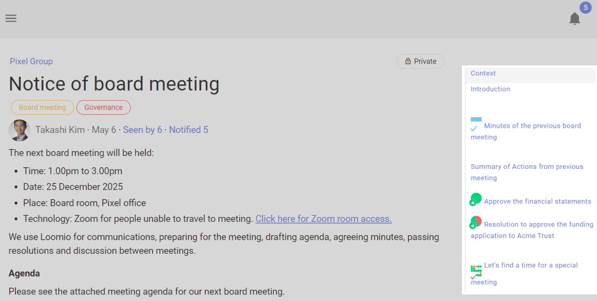

# Navigating in threads
_Find what you need, when you need it, in a thread._

## Context
The thread **context** is always at the top of the thread. Use it to frame the context for your discussion or decision. Learn more about engaging with the thread context [here](../engaging_with_threads/#thread-context).

## Timeline

The timeline helps you quickly access content in the thread such as comments, polls, decisions and outcomes. It is a visual, interactive history of key events, milestones and decision processes where you can see how a conversation evolved over time and the discussion that led to a decision.  

Comments formatted with a header, proposals and polls are automatically added to the timeline as links. Click the timeline text to go directly to the thread item.

You can pin or unpin any comment to the timeline, and edit the text displayed on the timeline.  See more at [Thread admin: Pin to Timeline](../thread_admin/#pin-to-timeline).

Jump to the top of the thread by clicking on "**Context**".

## Thread layout

By default comments in threads are listed one after the other as you scroll down the thread page - oldest comments first.  However you can change the thread order so that newest comments are listed at the top of the thread.  Seeing the latest comments first is useful for threads used for reporting or threads that have been active for some time.

The grey text just under the context will indicate in which order the activity is being listed, along with the number of replies.

To change this setting, click that grey text, choose your preference, and save. _This changes the layout for everyone, not just you._

### Options

## Unread comments 
When you open a thread, Loomio will first show you new comments. 

Unread comments are shown with a yellow line on the left side. 

