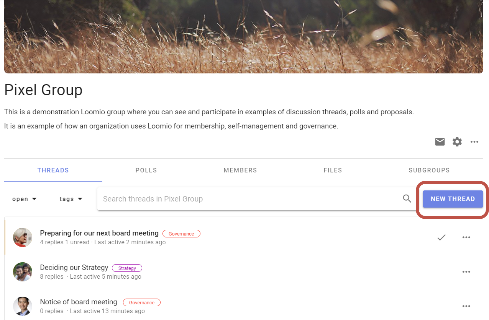
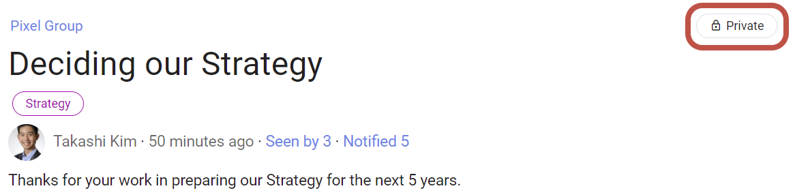
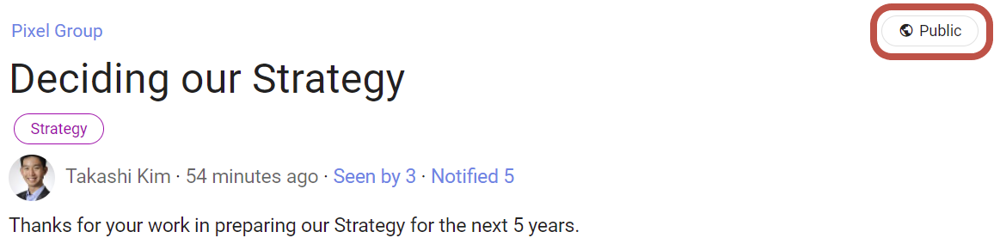

# Starting threads
_Get a discussion or decision going._

Threads are where you discuss topics.  Group members respond in the thread by posting comments and replies. Threads can also contain polls and proposals to help progress a discussion to an outcome.  As people comment in the thread and vote in polls, the thread timeline builds so you can easily find key milestones.

Here are some examples of topics you might use in threads:
- Draft and approve a strategic document
- Plan and deliver an event
- Seek advice and prepare a recommendation to stakeholders
- Submit a proposal to a customer, or to seek funding

See [Guides - Success on Loomio](https://help.loomio.com/en/guides/engage-group.html) for more tips and examples of how to use threads.

<iframe width="608" height="380" src="https://www.youtube.com/embed/1qxGl8MBA88" title="YouTube video player" frameborder="0" allow="accelerometer; autoplay; clipboard-write; encrypted-media; gyroscope; picture-in-picture" allowfullscreen></iframe>

## New thread

You can start a thread by clicking **New thread** from a group page. When you start the thread, it will be visible to all members of your group.

Give your thread a title; try to keep it short and to the point. You can always update the title of the thread later.

Use the thread **context** to introduce the topic and frame the conversation or decision to make. Include background information, attach files, link to online documents and embed a video. Let people know what you expect. 

The context will always stay at the top of the thread and you can update it at any time as the discussion progresses.  When the discussion ends, update the context with the outcome.

## Thread privacy
If your group privacy is **Closed** or **Secret** then your threads will be **private**. Private means that only members of the group are able to view the threads started in this group (*except* when you **invite people** such as an expert or any guest not currently part of your group).

If your group is "Open" then all your threads will be public, meaning that anyone with the URL can view the thread.

See [Group privacy](https://help.loomio.com/en/user_manual/groups/settings/index.html#privacy) for more info.
