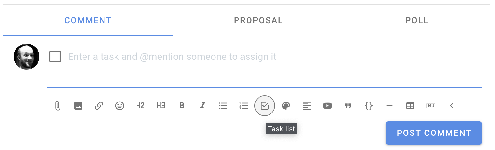
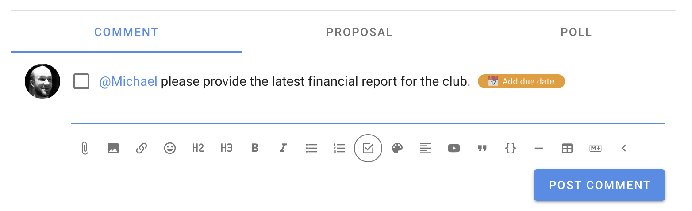

# Tasks

Tasks are a new feature of Loomio. The intention is to add support within threads to name and assign actions (or tasks) to people, and track their progress.

When you are writing a thread context, or a comment within Loomio, you can press the Task list button to insert a Task list within your text.

From here you can name the task, assign someone with the standard @mention tool, and even set a due date with a reminder notification.

When you have assigned tasks, or a task is assigned to you, the task will appear on your Tasks page so you can easily keep track of the tasks you’re responsible for.

The primary action for a task is to mark it as “done” by clicking the checkbox at the beginning of the task. This can be done while you’re editing the text, or when you’re reading the text if you’re the assignee of the task, and also from the Tasks page.
