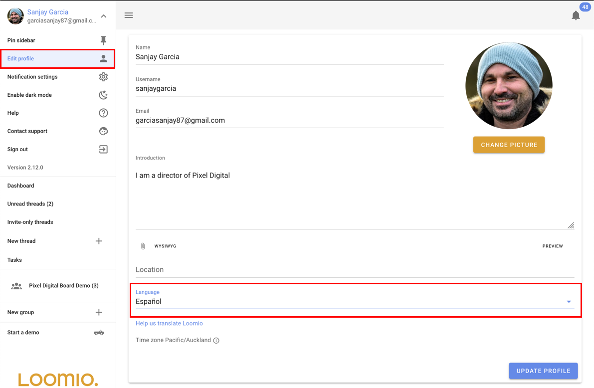
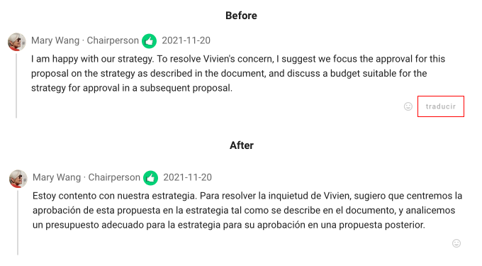

# Languages and Translation

Loomio supports mutliple languages with these two translation features:

1. Application tranlsation - Change the language of the user interface, IE: the buttons and application text.
2. Content translation - Translate comments, discussions and proposals into your preferred language.

## Application translation

Loomio will automatically detect what your preferred language is when you visit the app with your browser. 
If you want to change the preferred language, you can do so from the "Edit profile" page.

## Content translation
When someone in your group writes their message in a language that is different to your preferred language, a "translate" button will appear below the message. You can click this button to automatically translate the message into your preferred language.

Translation of the user content is provided by Google Translate, and done automatically when requested by users.

### Help translate Loomio

We depend on the support of our user community to help translate Loomio (the app) into other languages.

If you would like to help translate Loomio..

1. Visit the [Loomio Transifex page](https://www.transifex.com/projects/p/loomio-1/), and select your language

2. Select the resource you want to translate
- Client is the front end code that your browser runs.
- Server is the backend server code, which is mostly notification emails.

3. Click 'Translate'

4.
- Click on a phrase
- Read the english text
- Enter your translation
- Save and repeat

## Tips

You can use a [demo](https://www.loomio.org/try) to see Loomio in action, this can help provide contexts for strings when you see them via Transifex.

If your language distinguishes between personal and impersonal, use the more personal!

Make sure that you understand the different type of polls and activities that groups can do and that these are translated in way that is logical in your language.
