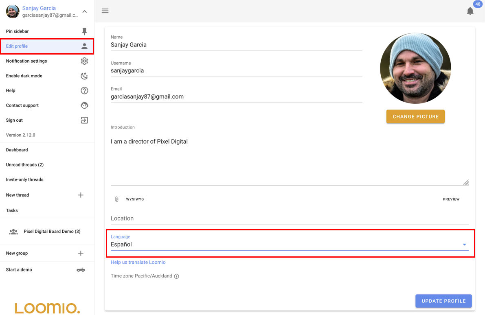

# Languages and Translation

Loomio supports mutliple languages with these two translation features:

1. Application tranlsation - Change the language of the user interface, IE: the buttons and application text.
2. Content translation - Translate comments, discussions and proposals into your preferred language.

## Application translation

Loomio will automatically detect what your preferred language is when you visit the app with your browser. 
If you want to change the preferred language, you can do so from the "Edit profile" page.

## Content translation
When someone in your group writes their message in a language that is different to your preferred language, a "translate" button will appear below the message. You can click this button to automatically translate the message into your preferred language.

### Help translate Loomio

We depend on the support of our user community to help translate Loomio into other languages. 
If you would like to help translate Loomio, please join [Loomio on Transifex](https://www.transifex.com/projects/p/loomio-1/). From there you can join a language project and add or improve translations.

### Sign up to Transifex

Visit the [Loomio Transifex page](https://www.transifex.com/projects/p/loomio-1/). Click the blue button: "Help Translate Loomio" then ask to join a translation.

### The basics

1. Visit the [Loomio Transifex page](https://www.transifex.com/projects/p/loomio-1/), and select your language

2. Select the resource you want to translate
- Client is the front end code that your browser runs.
- Server is the backend server code, which is mostly notification emails.
- Marketing is the loomio.org front page which explains Loomio to the world.

3. Click 'Translate'

4.
- click on a phrases
- read the english text
- enter your translation
- save and repeat

Please use the informal or personal form if your language has the option.

## Tips

You can use a [demo](https://www.loomio.org/try) to see Loomio in action, this can help provide contexts for strings when you see them via Transifex.

If your language distinguishes between personal and impersonal, use the more personal!

Make sure that you understand the different type of polls and activities that groups can do and that these are translated in way that is logical in your language.

## Content translation

You can change the language of the user interface (IE: the buttons and labels) and you translate comments and discussions between languages for you. So if you write something in English, and someone else speaks french, Loomio will offer a translate button, so people speaking different languages can speak to each other.

- It supports translation of the the user interface including , and translation of user content including comments, discussions, votes etc.

Translation of the user interface is provided by a community of Loomio users, who contribute to our open source code via a tool called "Transifex".

Translation of the user content is provided by Google Translate, and done automatically when requested by users.

## Guide for people to translate the Loomio user interface into another language.

At the time of writing, our the following languages have more than 80% translation coverage:

Polish (pl) 86%
Arabic (ar) 86%
German (de) 93%
Dutch (nl) 90%
French (fr) 100%
Spanish (es) 100%
Chinese (Taiwan) (zh_TW) 100%
Ukranian (uk) 99%
Dutch (90%)

We welcome any support to help keep our translation at 100%

